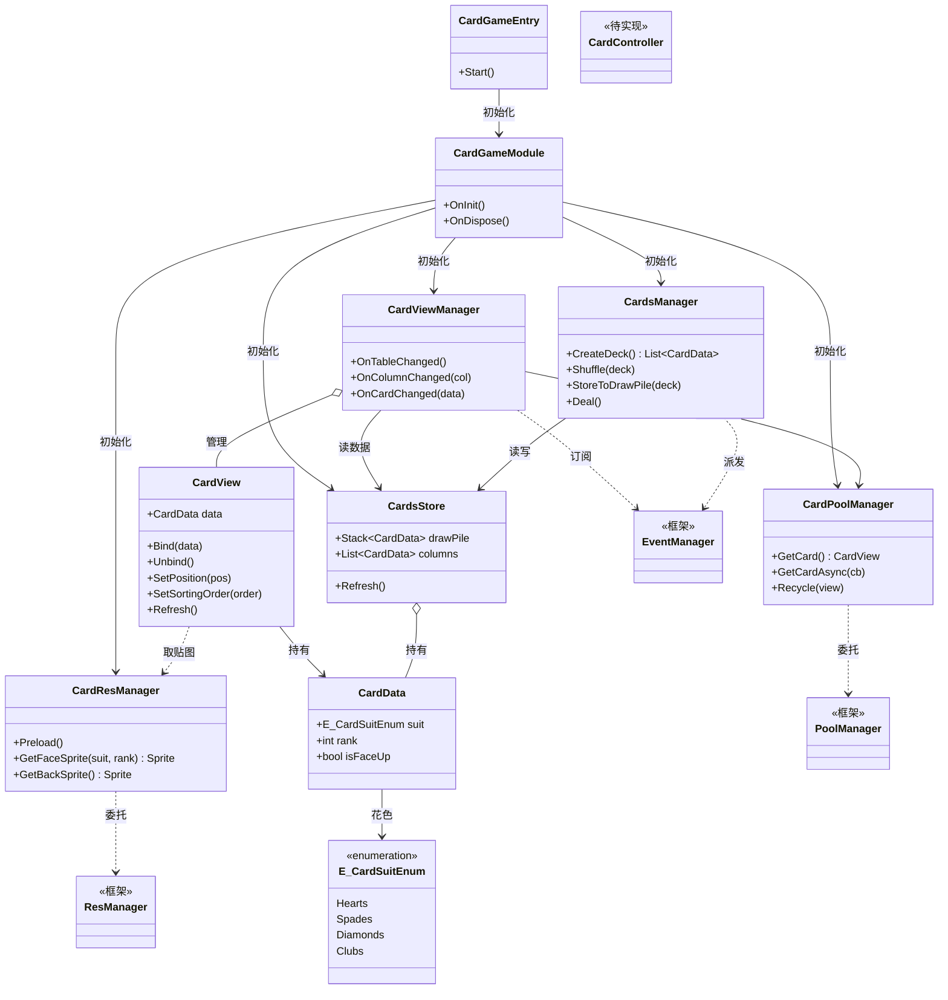

# 纸牌游戏架构设计

> 用法：在 VS Code 中打开本文件，点右上角「预览」图标，或 `Ctrl+Shift+V` / `Ctrl+K V` 查看渲染后的类图。

## 类图

```mermaid
classDiagram
    direction TB

    %% ============ 数据层（Store） ============
    class E_CardSuitEnum {
        <<enumeration>>
        Hearts
        Spades
        Diamonds
        Clubs
    }
    class CardData {
        +E_CardSuitEnum suit
        +int rank
        +bool isFaceUp
    }
    class CardsStore {
        +Stack~CardData~ drawPile
        +List~CardData~ columns
        +Refresh()
    }

    %% ============ 业务逻辑层（Manager） ============
    class CardsManager {
        +CreateDeck() List~CardData~
        +Shuffle(deck)
        +StoreToDrawPile(deck)
        +Deal()
    }
    class CardPoolManager {
        +GetCard() CardView
        +GetCardAsync(cb)
        +Recycle(view)
    }
    class CardResManager {
        +Preload()
        +GetFaceSprite(suit, rank) Sprite
        +GetBackSprite() Sprite
    }

    %% ============ 表现层（View） ============
    class CardViewManager {
        +OnTableChanged()
        +OnColumnChanged(col)
        +OnCardChanged(data)
    }
    class CardView {
        +CardData data
        +Bind(data)
        +Unbind()
        +SetPosition(pos)
        +SetSortingOrder(order)
        +Refresh()
    }

    %% ============ 门面 / 入口 ============
    class CardGameModule {
        +OnInit()
        +OnDispose()
    }
    class CardGameEntry {
        +Start()
    }

    %% ============ 控制层（Controller，待实现） ============
    class CardController {
        <<待实现>>
    }

    %% ============ 框架基础设施 ============
    class PoolManager {
        <<框架>>
    }
    class ResManager {
        <<框架>>
    }
    class EventManager {
        <<框架>>
    }

    %% ============ 关系 ============
    CardsStore o-- CardData : 持有
    CardData --> E_CardSuitEnum : 花色

    CardsManager --> CardsStore : 读写
    CardsManager ..> EventManager : 派发

    CardPoolManager ..> PoolManager : 委托
    CardResManager ..> ResManager : 委托

    CardViewManager --> CardsStore : 读数据
    CardViewManager --> CardPoolManager : 取牌/回收
    CardViewManager o-- CardView : 管理
    CardViewManager ..> EventManager : 订阅

    CardView --> CardData : 持有
    CardView ..> CardResManager : 取贴图

    CardGameModule --> CardsStore : 初始化
    CardGameModule --> CardResManager : 初始化
    CardGameModule --> CardPoolManager : 初始化
    CardGameModule --> CardViewManager : 初始化
    CardGameModule --> CardsManager : 初始化

    CardGameEntry --> CardGameModule : 初始化
```

