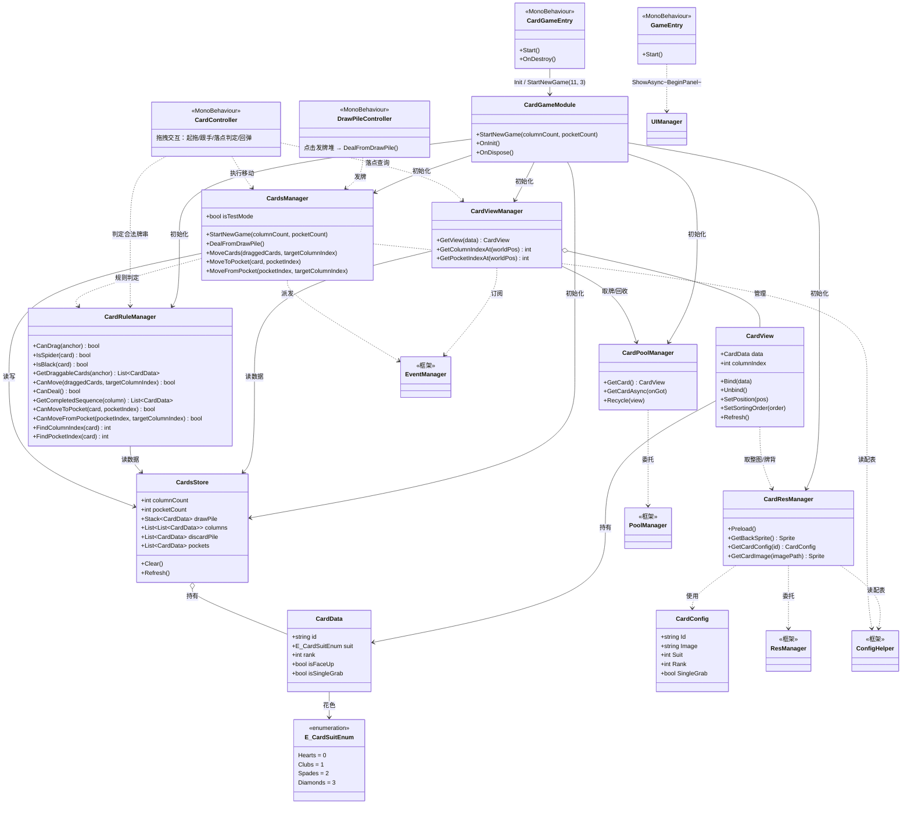

# 纸牌游戏架构设计（蜘蛛纸牌）

> 用法：在 VS Code 中打开本文件，点右上角「预览」图标，或 `Ctrl+Shift+V` / `Ctrl+K V` 查看渲染后的类图。

## 架构分层

采用 MVC 分层：数据层（Store）→ 逻辑层（Manager）→ 控制层（Controller）→ 表现层（View）。
数据变化通过事件中心 `EventManager` 派发，表现层订阅事件做「拉取式刷新」。

| 层 | 职责 | 类 |
|----|------|----|
| 数据层 Model | 场上卡牌纯数据，不引用 UnityEngine 对象 | `CardsStore`、`CardData`、`E_CardSuitEnum` |
| 逻辑层 Manager | 组牌/洗牌/发牌/移动、规则判定、资源加载、对象池 | `CardsManager`、`CardRuleManager`、`CardResManager`、`CardPoolManager` |
| 表现层 View | 创建/摆放/回收 CardView，订阅事件刷新 | `CardViewManager`、`CardView` |
| 控制层 Controller | 拖拽、点击发牌堆等输入交互 | `CardController`、`DrawPileController` |
| 配表 | Excel 驱动卡牌数据（自动生成 .cs + .json） | `CardConfig`、`ConfigHelper`、`ConfigExporter` |
| 门面 / 入口 | 模块初始化编排、场景入口、UI 入口 | `CardGameModule`、`CardGameEntry`、`GameEntry` |

## 类图



## 规则说明

### 花色

`E_CardSuitEnum` 枚举值恒等于花色图片索引、配表 `Suit`、id 花色位：

| 值 | 花色 |
|----|------|
| 0 | 红心 Hearts |
| 1 | 梅花 Clubs |
| 2 | 黑桃 Spades |
| 3 | 方块 Diamonds |

### 点数

`rank` 取值含义：

| rank | 含义 |
|------|------|
| 1-13 | 普通牌，1=A，13=K |
| -1 | 蜘蛛牌（同花色可连接） |
| -2 | 黑色牌（无花色无点数） |

### 特殊牌

| 类型 | rank | 规则 |
|------|------|------|
| 蜘蛛牌 | -1 | 参与连接时同花色即可（不要求逐张减 1）；不参与 A-K 顺子判定 |
| 黑色牌 | -2 | 无花色无点数，不能与任何牌连接；只能放空列；单抓 |

### 单抓属性 `isSingleGrab`

通用属性：**只能单独拖起单张，且必须位于列顶**（被压住时不可拖）。由配表 `SingleGrab` 决定，`CreateCard` 时读取：

- `SingleGrab = true` → 这张牌 `isSingleGrab = true`，拖拽走单抓分支
- `SingleGrab = false` → 正常整串拖拽

黑色牌只是该属性的一个使用方（配 `true`），未来其他特殊牌甚至普通牌都可复用。
注意：黑色牌「不能连接」「只能放空列」仍由 `IsBlack` 专属判定，不属于单抓属性。

## 配表约定

`CardConfig.xlsx`（`Config/Excel/`）由 `Tools/Export All Configs` 导出为 `Assets/Resources/Config/CardConfig.json` + `Assets/Scripts/Config/CardConfig.cs`。

| 字段 | 类型 | 说明 |
|------|------|------|
| Id | string | 主键，带前导零 |
| Image | string | 整张牌图文件名（相对 `Resources/GamePlay/Card/`，不含扩展名） |
| Suit | int | 花色 0-3 |
| Rank | int | 点数 1-13；-1 蜘蛛牌；-2 黑色牌 |
| SingleGrab | bool | 单抓属性 |

### id 编码

- 普通牌：`01` + 花色两位（00-03）+ 点数三位（001-013），如 `0100001` = 红心 A
- 特殊牌：`02` + 5 位编号，如 `0200005` = 黑色牌

### Excel 格式约定

- 第 1 行：字段名（空字段名的列为注释列，跳过）
- 第 2 行：类型（int / string / float / bool）
- 第 3 行：注释
- 第 4 行起：数据

## 事件一览（`E_EventEnum`）

| 事件 | 参数 | 含义 |
|------|------|------|
| OnTableChanged | 无 | 整桌刷新（发牌 / 重开） |
| OnColumnChanged | int 列索引 | 该列整列重建 |
| OnColumnAppend | int 列索引 | 该列末尾增量追加一张 |
| OnDrawPileChanged | int 数量 | 发牌堆剩余数量 |
| OnDiscardPileChanged | int 数量 | 弃牌堆数量 |
| OnPocketChanged | int 牌包索引 | 牌包变化 |
| OnCardChanged | CardData | 单张牌变化（如翻牌） |
| OnCardToDiscard | CardData | 单张牌回收到弃牌堆 |
| OnShuffleBack | 无 | 弃牌堆洗回发牌堆动画 |
| OnStraightCountChanged | 无 | 接龙次数变化（进度刷新） |
| OnLevelStart | 无 | 一局开始（选关后） |
| OnLevelComplete | 无 | 关卡完成（达成接龙次数，解锁下一关） |
| OnDiscardToDrawPile | 无 | 结算收牌：弃牌堆收回发牌堆动画（一张牌背代表整堆） |
| OnCardToDrawPile | CardData | 结算收牌：单张牌本体飞回发牌堆（场上列 / 牌包的牌） |
| OnCardsCollected | 无 | 结算收牌完成（关卡结束） |

## 接龙回收流程（A-K 同花顺）

`CheckAndDiscard(col)` 只负责找出顺子并**启动回收协程**：

```
CheckAndDiscard(col)
  → RecycleToDiscardRoutine(col, 13)

  ① 逐张播 A-K 飞向弃牌堆的动画（从列底往上，FlyInterval 间隔）
       每张同步：column 移除 → discardPile 加入 → OnCardToDiscard / OnDiscardPileChanged
  ② 等最后一张落地（FlyDuration）
  ③ OnColumnChanged 整列重建 + 新顶牌翻牌
  ④ straightCount++ → OnStraightCountChanged      ← 接龙次数等动画播完才增加
  ⑤ 达标？→ CheckWin（CompleteLevel 解锁/切层/挂奖励）→ StartCollectAll 收牌结算
     未达标 → TryShuffleBack
```

关键点：**接龙完成次数在回收动画播完之后才 +1**，所以进度面板不会先跳数字、再收牌；达标判定紧随其后，因此一局里最后一个接龙和普通接龙走的是同一条路。

> 注意：弃牌堆数据（`discardPile`、`OnDiscardPileChanged`）是**逐张随动画同步更新**的，与接龙次数不是一回事，不要混在一起改。

## 关卡完成结算流程

1. 最后一个接龙回收动画播完 → `RecycleToDiscardRoutine` 末尾 `CheckWin()` 达标：
   - `LevelManager.CompleteLevel()` 记录进度、解锁 `NextLevelId`、切层、挂起奖励，派发 `OnLevelComplete`
   - `CardsManager.StartCollectAll()` 开始收牌（`IsSettling = true`，期间锁输入）
2. 收牌顺序（`CollectAllRoutine`）：
   1. 弃牌堆 → 发牌堆：洗牌后整堆压回；表现层用**一张牌背**代表整堆飞回（与洗回动画一致）
   2. 场上各列 → 发牌堆：**逐列、逐张**把牌本体收回（`OnCardToDrawPile`），顺序与「顺子收进弃牌堆」相同——从列底 `column[Count-1]` 往上取，每张间隔 `FlyInterval`
   3. 各牌包 → 发牌堆：同样逐张飞牌本体
   4. 最后统一等一次 `FlyDuration` 让尾批落地，再派发 `OnCardsCollected`
3. 全部收完 → `IsSettling = false`、`IsPlaying = false`，派发 `OnCardsCollected`

> 收牌全流程**只在最末尾等待一次** `FlyDuration`：列与列、牌包与牌包之间不插入额外等待，上一批最后一张起飞后立即发起下一批第一张，保证动画连贯（发牌 `DealRoutine` 同理，全程只有 `FlyInterval` 间隔）。
4. `CardGameEntry` 收到 `OnCardsCollected` → 弹出 `LevelPanel`（**不关闭** `MainTopPanel`）

- 收牌期间 `CardsManager.IsSettling` 为 true，`CardController` / `DrawPileController` 据此锁输入。
- 测试接口：`CardsManager.Instance.DebugCompleteLevel()`（门面 `CardGameModule.Instance.DebugCompleteLevel()`），直接达成接龙次数并走完整收牌流程。

## 资源目录

- 牌背、整张牌图统一放 `Assets/Resources/GamePlay/Card/`（`cardBack` + 各牌整图）
- 卡牌预制体：`Resources/Prefab/GamePlay/Card/CardPrefab`
- 配表 JSON：`Assets/Resources/Config/`

## 关卡类型图标

`LevelTypeConfig.xlsx`（`Config/Excel/`）→ `Assets/Scripts/Config/LevelTypeConfig.cs` + `Assets/Resources/Config/LevelTypeConfig.json`

| 字段 | 类型 | 说明 |
|------|------|------|
| Id | string | 关卡类型 id，对应 `E_LevelTypeEnum`（0=普通 1=商店 2=BOSS） |
| IconImage | string | 图标文件名（相对 `Resources/GamePlay/Level/Icon/`，不含扩展名） |

- 图标统一放 `Assets/Resources/GamePlay/Level/Icon/`，导入类型需为 **Sprite**。
- `LevelResManager`（`GamePlay/Level/`）只维护「类型 id → 资源路径」映射并预热，图标缓存/引用计数复用 `ResManager`。
  - `GetIcon(int / E_LevelTypeEnum)`：同步返回 `Sprite`（`ResManager.Load` 命中缓存；若预热尚未完成，ResManager 内部会自动转同步）。
- UI 使用：`LevelBtnModule` 在 `Bind` 时 `_imgIcon.sprite = LevelResManager.Instance.GetIcon(cfg.LevelType)`。

## 商店

商店关（`LevelType == Shop`）进入时不开局，改为弹 `ShopPanel`。

| 层 | 文件 |
|----|------|
| Store | `GamePlay/Shop/ShopStore.cs`（`List<ShopGoods> goods`） |
| Manager | `GamePlay/Shop/ShopManager.cs` |
| UI | `UI/GamePlay/ShopPanel.cs` + `UI/GamePlay/Item/ShopCardItem.cs` |

### 商品刷新（`ShopManager.OpenShop`）

| 位置 | 来源 | 数量 | 单价 |
|------|------|------|------|
| 前 2 件 | `CardConfig.Id` 以 `02` 开头的特殊牌 | 2 | 100 |
| 后 4 件 | `CardConfig.Id` 以 `01` 开头的普通牌 | 4 | 0 |

- 按前缀分组后各自洗牌取前 N，同批不重复；候选不足时有多少取多少。
- 每次打开 `ShopPanel` 都重新随机（`OnOpen` 里调 `OpenShop`）。

### 流程

```
选关点商店关
  → LevelManager.SelectLevel：LevelType==Shop → 记 selectedLevelId → Dispatch(OnShopOpen)
  → CardGameEntry：Hide(LevelPanel) + Show<ShopPanel>
  → ShopPanel.OnOpen：OpenShop() 随机商品 → Dispatch(OnShopChanged) → 列表刷新
  → 点 btnContinue → ShopManager.ContinueNextLevel()
        CompleteLevel(selectedLevelId)   // 解锁下一批 + 层号推进 + Dispatch(OnLevelComplete)
        Dispatch(OnShopClosed)
  → CardGameEntry：Hide(ShopPanel) + Show<LevelPanel>()
```

- `ShopCardItem.Bind(index, goods)`：`btnCard.image.sprite = CardResManager.GetCardImage(cfg.Image)`，价格写到 `txtCoin`。
- 点击 `btnCard` → `ShopManager.TryBuy(index)`：当前只把 `goods.sold = true` 并刷新列表（按钮置灰、文案变"已售出"）。
  **待接**：金币校验（`TODO`）、购买后加入玩家牌组（`TODO`）。
- 事件：`OnShopOpen` / `OnShopChanged` / `OnShopClosed`。

## 一大局资产（金币）

`RunStore` / `RunManager`（`GamePlay/Run/`）管理**一整局游戏**（一大局：从第一层到通关）的玩家资产，目前只有金币。

- 作用域是「一大局」，**不是**跨局长期资产；进 card 场景即开始新的一大局：
  `CardGameEntry.Start()` → `RunManager.StartNewRun()` → `RunStore.Reset()`（金币归零）
- 暂时**不接存档**；`RunStore.Reset()` 后续会换成"读档 / 建档"的逻辑，支持中途继续。

```csharp
RunManager.Instance.Coin;              // 当前金币
RunManager.Instance.IsEnough(100);     // 是否够
RunManager.Instance.AddCoin(150);      // 加钱（通关奖励）
RunManager.Instance.TrySpend(100);     // 扣钱（不足返回 false）
```

| 收支 | 位置 |
|------|------|
| +`LevelConfig.FinishReward` | `LevelManager.SettleLevelReward()` —— 与层号刷新同一时机（结算动画之后） |
| −`ShopGoods.price` | `ShopManager.TryBuy()`（先 `IsEnough` 判定，不足则购买失败） |

**奖励发放时机**（与层号刷新对齐，都在结算动画之后）：

1. 接龙达标 → `LevelManager.CompleteLevel()`：解锁下一批、切层，同时把 `FinishReward` 挂到 `LevelStore.pendingReward`（**此时不加钱**）
2. 收牌结算动画播完 → `CardsManager.CollectAllRoutine` 末尾调 `LevelManager.SettleLevelReward()` → `RunManager.AddCoin(pendingReward)` → `Dispatch(OnCoinChanged)`
3. 紧接着 `Dispatch(OnCardsCollected)` → `MainTopPanel` 刷新层号

商店关没有收牌结算，由 `ShopManager.ContinueNextLevel()` 在 `CompleteLevel` 之后直接调 `SettleLevelReward()`（商店关 `FinishReward` 配 0，实际加 0）。

- 事件 `OnCoinChanged`（无参）→ `MainTopPanel.RefreshCoinInfo()` 把数字写到 `txtCoinInfo`。
- `MainTopPanel` 在 `OnOpen` / `OnShow` 也会主动拉一次，覆盖"事件派发时面板还没打开"的情况。

## 模块初始化归口

关卡（含关卡图标）、商店、一大局资产、卡牌这些**卡牌游戏业务**模块，由 `CardGameModule` 门面统一初始化（按依赖顺序）与销毁（反序）：

```
CardGameEntry.Start()    → CardGameModule.Instance.Init()      // 进 card 场景
CardGameEntry.OnDestroy  → CardGameModule.Instance.Dispose()   // 离开 card 场景
```

| 门面内（业务） | 注册的 Store | 注册的 Manager |
|---------------|-------------|---------------|
| 关卡 | `LevelStore` | `LevelManager`、`LevelResManager` |
| 资产 | `RunStore` | `RunManager` |
| 商店 | `ShopStore` | `ShopManager` |
| 卡牌 | `CardsStore` | `CardResManager`、`CardPoolManager`、`CardViewManager`、`CardRuleManager`、`CardsManager` |

框架级模块（`MonoManager` / `ResStore` / `ResManager` / `PoolStore` / `PoolManager` / `EventManager` / `SaveManager` / `UIManager` / `BgmManager` / `SoundManager` / `SceneController` / `ConsoleCommandManager`）仍由 `FrameworkEntry.InitFramework()` 负责，两者互不越界。


