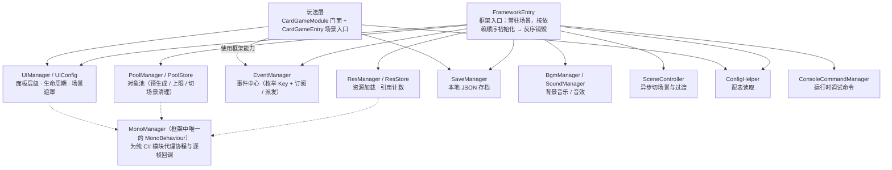
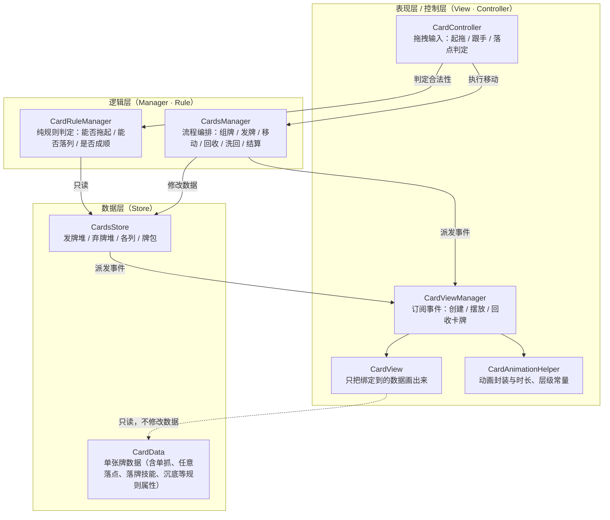
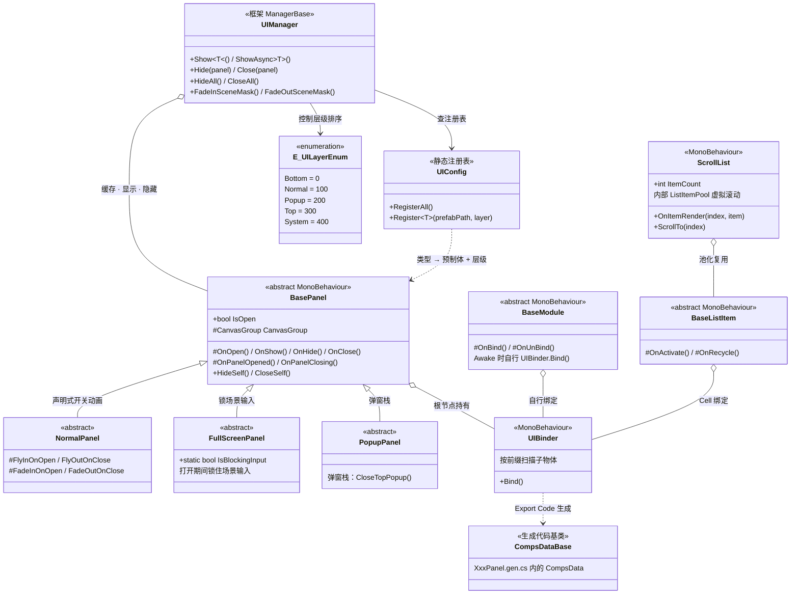
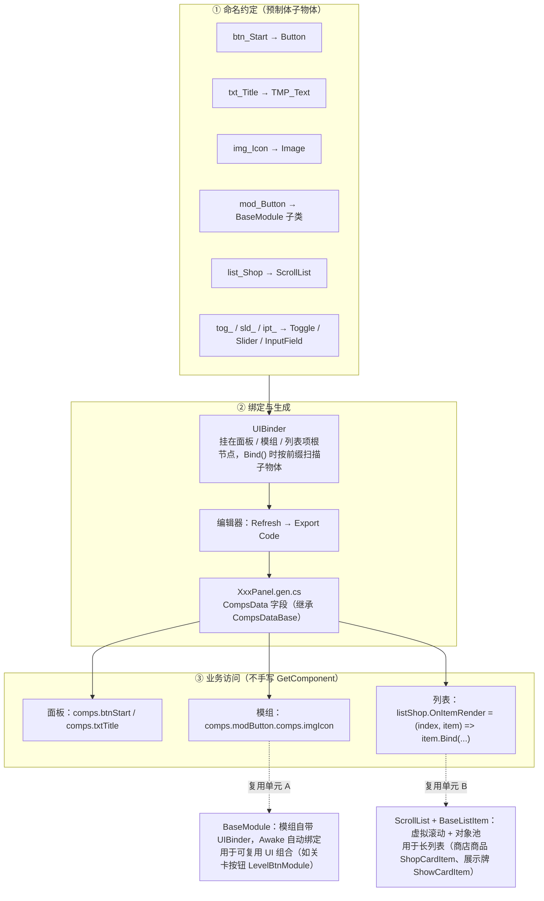
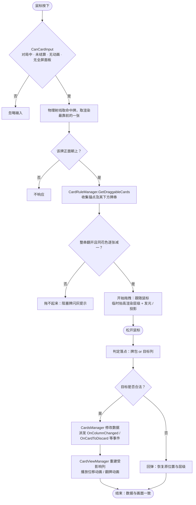

# 结题报告配图（Mermaid）

> 用法：VS Code 打开本文件按 `Ctrl+K V` 预览，或把每段 ```mermaid 代码块粘到 https://mermaid.live 导出 PNG/SVG，再插入报告对应位置。

| 图号 | 内容 | 插入位置（报告章节） |
|------|------|----------------------|
| 图3-1 | 框架模块图 | 3.2 系统功能 |
| 图3-2 | 卡牌玩法 MVC 分层图 | 3.3 主要类图 |
| 图4-1 | UI 类架构图（面板基类 / 绑定 / 模组 / 列表） | 4.1 界面设计 |
| 图4-2 | 控件绑定与 UI 复用链路图 | 4.1 界面设计 |
| 图4-3 | 拖拽落牌流程图 | 4.2 流程图 |

---

## 图3-1 框架模块图



框架层只提供基础能力、不出现任何纸牌概念；初始化顺序即依赖顺序，销毁反序进行。

---

## 图3-2 卡牌玩法 MVC 分层图



依赖方向单向：输入 / 界面 → 逻辑 → 数据；表现层通过事件被动刷新，不反向调用逻辑层。

---

## 图4-1 UI 类架构图



`BasePanel` 统一生命周期（Open / Show / Hide / Close），在其上派生三种面板：普通面板只声明开关动画、全屏面板打开时锁场景输入、弹窗面板参与弹窗栈；`UIBinder` 是面板 / 模组 / 列表项共用的绑定入口，`BaseModule`（模组）与 `ScrollList + BaseListItem`（列表）是两类可复用的 UI 单元。

---

## 图4-2 控件绑定与 UI 复用链路图



控件不靠 `GetComponent` 手动查找，而是「命名约定 → 自动绑定 → 生成代码 → `comps.xxx` 访问」；模组与列表分别把「可复用的 UI 组合」和「长列表」封装起来，面板只负责组织它们。

---

## 图4-3 拖拽落牌流程图



数据只被逻辑层修改一次，表现层只负责「读数据画画面」；动画未结束时输入保持锁定。
